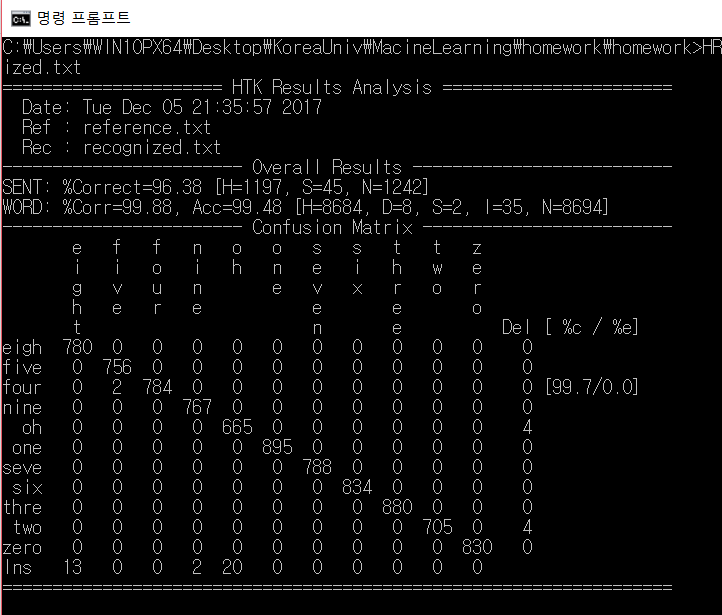

Speech Recognition with Viterbi-Decoding
===============

Implementation of **Viterbi decoding** for the number recognition  

* Transition probabilty was pre-trained by **Baum-Welch algorithm**
* Observation probability is defined by **Gaussian Mixture Model**
* Transition probability within words was defined by **unigram and bigram** probability.

  **Results** 

99.88% accuracy in words and 96.38% accuracy in sentences.  

